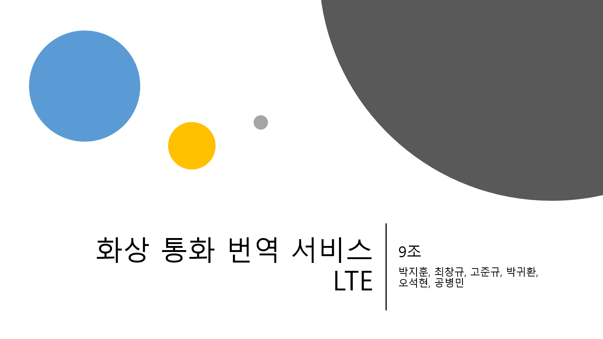
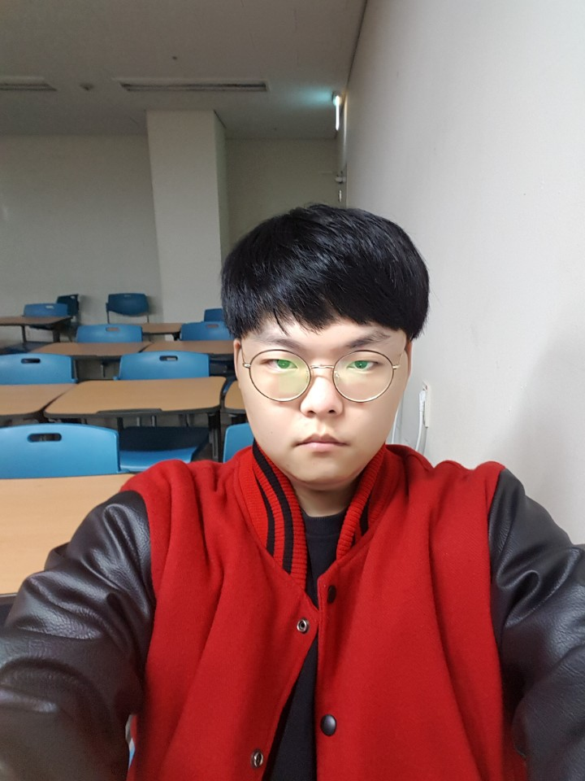

## LTE (Language Translate Easily)

### 1. 프로젝트 소개
**실시간 화상통화 번역 서비스**

   실시간 번역 시스템의 추진 배경으로는 글로벌 시대로 나아가고 있는 요즘 국가, 언어, 인종에 상관없이 다양한 인간관계를 형성하고 다국적 기업들의 성장이 두드러지는 현대 사회에 맞춰 서로의 언어가 달라도 의사소통을 원활하게 할 필요성을 느꼈고 이로 인해 실시간 번역 시스템을 추진하게 되었습니다.

### 2. Abstract

   The driving force behind the real-time translation system is the need to facilitate communication even if each other's languages differ depending on the modern society, where people are forming diverse relationships regardless of country, language or race, and multinational companies are growing, and this is why we are promoting the real-time translation system.
 
### 3. 소개 영상

- 수행계획 영상
 
[](https://youtu.be/bW6hij2PoGA)
  
### 4. 팀 소개
 저희 팀은 이재구 교수님과 6명의 학부생으로 구성되어 있습니다.
 
#### Professor
  - 이재구 교수님
 
#### 팀원
 
- 박지훈(팀장)

</img>
 
 ```
 * 학번: 20133226
 * 역할: 웹 개발 및 네트워크 통신 구축
 * E-mail: hoonzinope@kookmin.ac.kr
 ```
 
<br> 
- 고준규
 
</img>
 
  ```
 * 학번: 20133191
 * 역할: 번역 서버 개발(Translate 환경)
 * E-mail: rhwnsrb94@gmail.com
 ```
 
<br>    
- 공병민
 
</img>
 
 ```
 * 학번: 20143029
 * 역할: 번역서버 개발(Speech To Text 환경)
 * E-mail: gongbyeongmin@gmail.com
 ```
 
 <br> 
- 최창규
 
</img>

 ```
 * 학번: 20143110
 * 역할: 화상통화 백엔드 서버 개발
 * E-mail: uppletaste@gmail.com
 ```
 
<br>  
- 박귀환
 
</img>

 ```
 * 학번: 20132872
 * 역할: 번역서버 개발 & 최적화
 * E-mail: pgh224@naver.com
 ```
 
<br>  
- 오석현
 
</img>

 ```
 * 학번: 20130671
 * 역할: 웹 개발 & 유저 인터페이스 구현
 * E-mail: sho1007@kookmin.ac.kr
 ```

### 5. 사용법

- 웹 페이지에 접속하면 로그인 페이지가 나옵니다. 사용할 닉네임과 언어를 선택하고 로그인합니다. 
  
- 방 목록 페이지에 들어오면 기존에 있는 방에 들어가거나 새로운 방을 생성 할 수 있습니다. 비밀번호가 걸려있는 방은 비밀번호를 써야 입장할 수 있습니다.
  
- 방생성 페이지에는 방의 제목, 제한 인원 수, 비밀번호를 설정 하여 방을 생성할 수 있습니다. 
  
- 채팅화면에서는 사용자들끼리 방을 화상통화를 수행할 수 있고 우측에는 사용자들이 대화한 음성들이 사용자의 언어로 번역되어 display됩니다.
  
- 자세한 사항은 웹페이지의 'Notice'를 참조하십시오.

### 6. 기타

- 추후 추가 예정
 
